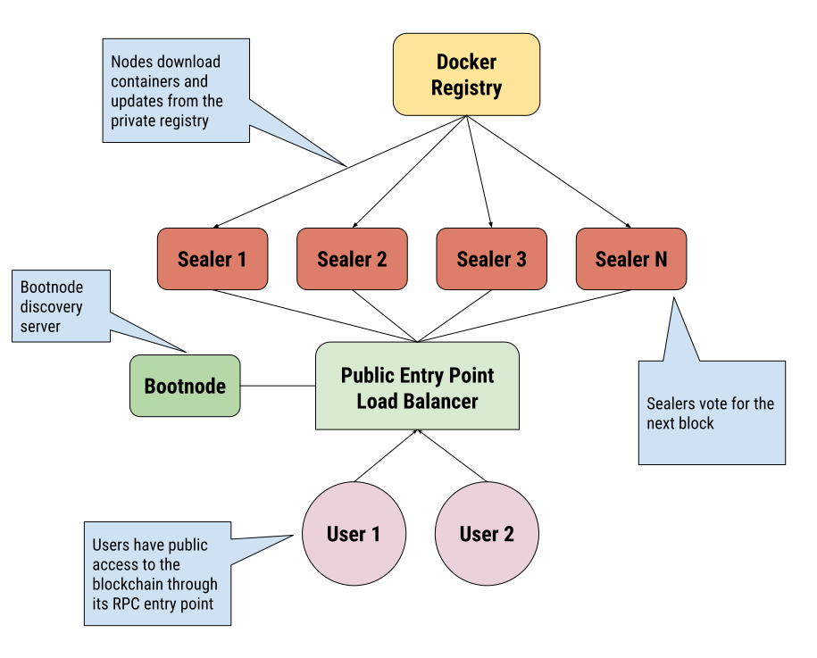

# VarnaChain
Permissioned City Level Blockchain

## Abstract
VarnaChain will be a permissioned blockchain and infrastructure for it built in the city of Varna. The blockchain will be used for free public services, tests and experimental projects. First version will be built on Ethereum PoA. The control of the network will be done by Smart Contracts defining a DAO.  

## Infrastructure


### Ethereum Proof of Authority and Clique Protocol
https://github.com/ethereum/EIPs/issues/225

### Docker Registry
Will store and deploy the containers needed for all participants to operate. Updates will be managed also by this registry. It is a private registry as it is not needed the public to have access to that part. Though all the containers will be open sourced to be validated.

Setting up the provate registry:
https://docs.docker.com/registry/deploying/

## Geth Commands
Some useful commands for setting up the nodes

## Create Account (Key Store)
```
$ geth --datadir <datadir>/ account new
Your new account is locked with a password. Please give a password. Do not forget this password.
Passphrase: ******
Repeat passphrase: ******
Address: {87366ef81db496edd0ea2055ca605e8686eec1e6}
```

## Initialize Node
```
$ geth --datadir <datadir>/ init varnachain.json
```

## Initialize Bootnode
```
$ bootnode -genkey boot.key
```

## Start Bootnode
The first time a node connects to the network it uses one of the predefined bootnodes. Through these bootnodes a node can join the network and find other nodes. In the case of a private cluster these predefined bootnodes are not of much use. Therefore go-ethereum offers a bootnode implementation that can be configured and run in your private network.
```
$ bootnode -nodekey boot.key -verbosity 9 -addr :<10666>
INFO [02-07|22:44:09] UDP listener up                          self=enode://3ec4fef2d726c2c01f16f0a0030f15dd5a81e274067af2b2157cafbf76aa79fa9c0be52c6664e80cc5b08162ede53279bd70ee10d024fe86613b0b09e1106c40@[::]:30310
```
Copy the enode address

## Start Node
```
$ geth --datadir <datadir>/ --syncmode 'full' --port <10667> --rpc --rpcaddr 'localhost' --rpcport 8545 --rpcapi 'personal,db,eth,net,web3,txpool,miner' --bootnodes '<enode://3ec4fef2d726c2c01f16f0a0030f15dd5a81e274067af2b2157cafbf76aa79fa9c0be52c6664e80cc5b08162ede53279bd70ee10d024fe86613b0b09e1106c40>@127.0.0.1:<10666>' --networkid <1515> --gasprice '1' -unlock '0x87366ef81db496edd0ea2055ca605e8686eec1e6' --password password.txt --mine
```
